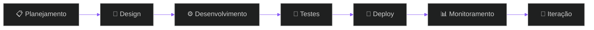

<div align="center">


<a href="https://git.io/typing-svg">
  
</a>

<br/>

[](https://gustavogoncalves.dev.br)
[](mailto:gustavolgoncalves05@gmail.com)
[](https://linkedin.com/in/gustavo-lg)

</div>


## 🎯 Sobre Mim

Sou **desenvolvedor fullstack** apaixonado por transformar conceitos complexos em produtos elegantes, escaláveis e de alta performance. Trabalho na interseção entre **arquitetura de SaaS, integração de APIs e automação com IA**, entregando experiências que funcionam bem e impressionam.

```typescript
const gustavo = {
  codigo: ["TypeScript", "JavaScript", "Python", "SQL"],
  frameworks: {
    frontend: ["Next.js", "React", "Tailwind CSS", "Material UI"],
    backend: ["Node.js", "Express", "Firebase", "Supabase"],
    mobile: ["FlutterFlow", "React Native"],
  },
  especialidades: [
    "🚀 Plataformas SaaS completas",
    "🤖 Integração de IA (OpenAI, Claude, automações)",
    "💳 Pagamentos (Stripe, Hotmart, Green)",
    "⚡ Performance & SEO avançado",
    "🔗 APIs RESTful e webhooks",
    "📊 Dashboards administrativos",
  ],
  atualmente: "Criando soluções com Next.js 15 e IA generativa",
  disponivel: true,
} as const;
```


## 🛠️ Stack Tecnológica

<div align="center">

**Frontend**


**Backend & Database**


**Integrações & Tools**


</div>


## 📊 GitHub Analytics

<div align="center">
  
  
</div>

<div align="center">
  
</div>

### 🐍 Contribution Snake

<div align="center">
  <picture>
    <source media="(prefers-color-scheme: dark)" srcset="https://raw.githubusercontent.com/gustavo-lg/gustavo-lg/output/github-contribution-grid-snake-dark.svg" />
    <source media="(prefers-color-scheme: light)" srcset="https://raw.githubusercontent.com/gustavo-lg/gustavo-lg/output/github-contribution-grid-snake.svg" />
    
  </picture>

  <sub>Gerado automaticamente pela GitHub Action em <code>.github/workflows/snake.yml</code></sub>
</div>


## 🚀 Projetos & Realizações

<details open>
<summary><b>🤖 Plataforma SaaS de Automação com IA</b></summary>
<br>

- Sistema completo de assinaturas com múltiplos planos
- Integração de chatbot inteligente com OpenAI/Claude
- Painel administrativo com métricas em tempo real
- Sistema de pagamentos Stripe/Hotmart
- Autenticação e gestão de usuários avançada

`Next.js` `TypeScript` `Supabase` `OpenAI API` `Stripe`

</details>

<details>
<summary><b>💼 Sites Corporativos de Alta Performance</b></summary>
<br>

- Desenvolvimento com Next.js 15 e App Router
- SEO avançado com SSR e ISR para performance máxima
- Design responsivo e acessível (WCAG 2.1)
- Integração com CMS headless
- Analytics e tracking de conversões

`Next.js` `Tailwind CSS` `Shadcn/ui` `Google Analytics`

</details>

<details>
<summary><b>🔗 Sistema de Automação Multi-canal</b></summary>
<br>

- Automação de fluxos de trabalho com n8n
- Integração WhatsApp Business API
- Webhooks e sincronização de dados
- Notificações inteligentes por múltiplos canais
- Dashboard de monitoramento de automações

`n8n` `Node.js` `WhatsApp API` `Firebase`

</details>

<details>
<summary><b>📸 App de Mosaico de Fotos</b></summary>
<br>

- Aplicativo mobile completo (iOS/Android)
- Captura e processamento de imagens
- Montagem automática de mosaicos
- Exportação em PDF de alta qualidade
- Sistema de templates customizáveis

`FlutterFlow` `Supabase` `Cloud Functions`

</details>


## 🎓 Conhecimentos & Certificações

<div align="center">

| Área | Nível | Experiência |
|------|-------|-------------|
| **Next.js & React** | ⭐⭐⭐⭐⭐ | Projetos em produção com milhares de usuários |
| **TypeScript** | ⭐⭐⭐⭐⭐ | Desenvolvimento de arquiteturas complexas |
| **Integração de APIs** | ⭐⭐⭐⭐⭐ | Múltiplas integrações (Stripe, OpenAI, etc) |
| **Firebase/Supabase** | ⭐⭐⭐⭐⭐ | Gerenciamento completo de backend |
| **UI/UX Design** | ⭐⭐⭐⭐ | Design systems e componentização |
| **SEO & Performance** | ⭐⭐⭐⭐⭐ | Otimização avançada e Core Web Vitals |
| **Automação com IA** | ⭐⭐⭐⭐ | Chatbots e automações inteligentes |

</div>


## 💡 Metodologia de Trabalho



- ✅ **Código limpo e documentado** seguindo melhores práticas
- ✅ **Arquitetura escalável** pensada para crescimento
- ✅ **Foco em performance** e experiência do usuário
- ✅ **Comunicação transparente** durante todo o projeto
- ✅ **Entrega contínua** com deploys automatizados


## 📈 Impacto & Resultados

<div align="center">

| Métrica | Valor |
|---------|-------|
| 🚀 **Projetos Entregues** | 50+ |
| 👥 **Usuários Ativos** | 10k+ |
| ⚡ **Performance Média** | 95+ (Lighthouse) |
| 💼 **Clientes Satisfeitos** | 98% |
| 🎯 **Uptime Médio** | 99.9% |

</div>


## 🤝 Vamos Trabalhar Juntos?

<div align="center">

### 💼 Estou disponível para:

✨ **Desenvolvimento de SaaS** — Do MVP ao produto escalável
🎨 **Landing Pages & Sites** — Design moderno e alta conversão
🤖 **Automação com IA** — Chatbots e processos inteligentes
🔗 **Integrações Complexas** — APIs, webhooks e sistemas
📊 **Consultoria Técnica** — Arquitetura e otimização

<br/>

[](https://gustavogoncalves.dev.br)
[](mailto:gustavolgoncalves05@gmail.com)

<br/>

**Email:** gustavolgoncalves05@gmail.com
**Portfólio:** [gustavogoncalves.dev.br](https://gustavogoncalves.dev.br)
**Status:** 🟢 Disponível para novos projetos

</div>

<div align="center">

### ⭐ *"Construindo o futuro, uma linha de código por vez."*


**Gostou do perfil? Deixe uma ⭐ nos repositórios!**

</div>


