<!-- HERO BANNER ANIMADO -->

 

<!-- QUICK ACTION CAPSULES -->

  
  
  

<!-- BENTO ROW 1: TERMINAL INTERATIVO & CORE IDENTITY -->
<table border="0" cellspacing="0" cellpadding="0" width="100%">
  <tr>
    <td width="58%" valign="top">
       
      
    </td>
    <td width="42%" valign="top" style="padding-left: 20px;">
       
      <h3>⚡ Sobre Mim &amp; Arquitetura</h3>
      

        Desenvolvedor Fullstack com foco em <b>soluções escaláveis, SaaS de alta performance e automações inteligentes com IA</b>.
      

      

        Combino código limpo com arquiteturas modernas para transformar ideias complexas em produtos prontos para produção, com velocidade extrema e máxima confiabilidade.
      

      <ul>
        <li>🚀 <b>Next.js 15 &amp; TypeScript:</b> SSR, RSC, App Router &amp; Server Actions</li>
        <li>🤖 <b>IA Generativa:</b> Integração de LLMs, agentes autônomos e pipelines n8n</li>
        <li>💳 <b>Monetização:</b> Stripe, Hotmart e gateways com webhooks seguros</li>
        <li>⚡ <b>Core Web Vitals:</b> Foco em notas 95+ no Google Lighthouse</li>
      </ul>
    </td>
  </tr>
</table>

<!-- BENTO ROW 2: TECH STACK ECOSYSTEM -->

  <h2>🛠️ Ecossistema &amp; Stack Tecnológica</h2>
  
<i>As ferramentas e linguagens que utilizo diariamente para criar produtos excepcionais:</i>

   

  <!-- FRONTEND -->
  

    <b>Frontend &amp; Experiência do Usuário</b> 
    
  

  <!-- BACKEND & DATA -->
  

    <b>Backend, Bancos de Dados &amp; Cloud</b> 
    
  

  <!-- TOOLS, AI & DEVOPS -->
  

    <b>IA, Automações &amp; Infraestrutura</b> 
    
  

<!-- BENTO ROW 3: FEATURED PROJECTS & SOLUTIONS -->

  <h2>🚀 Soluções em Produção &amp; Projetos em Destaque</h2>

<table border="0" cellspacing="12" cellpadding="16" width="100%">
  <tr>
    <td width="50%" bgcolor="#0B1120" style="border-radius: 12px; border: 1px solid #1E293B;">
      <h3>🤖 Plataforma SaaS com IA Autônoma</h3>
      
Ecossistema completo com cobrança recorrente, chatbots cognitivos integrados via OpenAI/Claude e painel de métricas analíticas em tempo real.

      

        <code>Next.js 15</code> • <code>TypeScript</code> • <code>Supabase</code> • <code>OpenAI API</code> • <code>Stripe</code>
      

      

        
        
      

    </td>
    <td width="50%" bgcolor="#0B1120" style="border-radius: 12px; border: 1px solid #1E293B;">
      <h3>💼 Websites Corporativos Ultra-Velozes</h3>
      
Aplicações web modernas desenvolvidas com App Router, renderização híbrida (SSR/ISR) e conformidade estrita de SEO avançado e acessibilidade (WCAG).

      

        <code>Next.js 15</code> • <code>Tailwind CSS</code> • <code>Shadcn/ui</code> • <code>Cloudflare Edge</code>
      

      

        
        
      

    </td>
  </tr>
  <tr>
    <td width="50%" bgcolor="#0B1120" style="border-radius: 12px; border: 1px solid #1E293B;">
      <h3>🔗 Sistema de Automação Multi-Canal</h3>
      
Orquestração de eventos e integrações corporativas com n8n, webhooks assíncronos e mensageria inteligente via WhatsApp Business API.

      

        <code>n8n</code> • <code>Node.js</code> • <code>WhatsApp API</code> • <code>Firebase</code>
      

      

        
        
      

    </td>
    <td width="50%" bgcolor="#0B1120" style="border-radius: 12px; border: 1px solid #1E293B;">
      <h3>📸 App Mobile de Mosaicos Visuais</h3>
      
Aplicativo móvel multiplataforma com processamento inteligente de fotos, renderização dinâmica de mosaicos e exportação de relatórios em PDF de alta definição.

      

        <code>FlutterFlow</code> • <code>Supabase</code> • <code>Cloud Functions</code>
      

      

        
        
      

    </td>
  </tr>
</table>

<!-- BENTO ROW 4: GITHUB ACTIVITY & ANIMATED SNAKE -->

  <h2>📊 Atividade &amp; Estatísticas em Tempo Real</h2>

  <!-- CONTRIBUTION SNAKE GAME -->
  <picture>
    <source media="(prefers-color-scheme: dark)" srcset="https://raw.githubusercontent.com/gustavo-lg/gustavo-lg/output/github-contribution-grid-snake-dark.svg">
    <source media="(prefers-color-scheme: light)" srcset="https://raw.githubusercontent.com/gustavo-lg/gustavo-lg/output/github-contribution-grid-snake.svg">
    
  </picture>

    

  <!-- GITHUB STREAK STATS -->
  

    

  <!-- GITHUB TROPHIES -->
  

<!-- BENTO ROW 5: CALL TO ACTION & FOOTER -->

  <h2>🤝 Vamos Construir Algo Extraordinário?</h2>
  
Estou aberto para desenvolvimento de novos produtos SaaS, integrações de IA e consultoria técnica.

   

  

    
    &nbsp;&nbsp;
    
  

   

  

  
<i>"Construindo o futuro com arquiteturas escaláveis, código limpo e inteligência artificial."</i>

