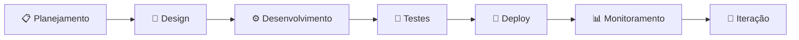

<div align="center">
  
# 👋 Gustavo L Gonçalves

### Desenvolvedor Fullstack | Especialista em Soluções SaaS & IA

[](https://gustavogoncalves.dev.br)
[](mailto:gustavolgoncalves05@gmail.com)
[](https://linkedin.com/in/gustavo-lg)


</div>

---

## 🎯 Sobre Mim

Sou **desenvolvedor fullstack** apaixonado por criar soluções digitais que geram impacto real. Minha expertise está em transformar conceitos complexos em produtos elegantes, escaláveis e de alta performance.

Com experiência em **arquitetura de SaaS, integração de APIs e automação com IA**, entrego projetos que não apenas funcionam perfeitamente, mas que também oferecem experiências excepcionais aos usuários.

### 💼 Diferenciais

```typescript
const gustavo = {
  codigo: ["TypeScript", "JavaScript", "Python", "SQL"],
  frameworks: {
    frontend: ["Next.js", "React", "Tailwind CSS", "Material UI"],
    backend: ["Node.js", "Express", "Firebase", "Supabase"],
    mobile: ["FlutterFlow", "React Native"]
  },
  especialidades: [
    "🚀 Desenvolvimento de plataformas SaaS completas",
    "🤖 Integração de IA (OpenAI, Claude, automações inteligentes)",
    "💳 Sistemas de pagamento (Stripe, Hotmart, Green)",
    "⚡ Otimização de performance e SEO avançado",
    "🔗 Arquitetura de APIs RESTful e webhooks",
    "📊 Dashboards e painéis administrativos"
  ],
  atualmente: "Criando soluções inovadoras com Next.js 15 e IA generativa",
  disponivel: true
};
```

---

## 🛠️ Stack Tecnológica

<div align="center">

### Frontend


### Backend & Database


### Integrações & Tools


</div>

---

## 🚀 Projetos & Realizações

<details open>
<summary><b>🤖 Plataforma SaaS de Automação com IA</b></summary>
<br>

- Sistema completo de assinaturas com múltiplos planos
- Integração de chatbot inteligente com OpenAI/Claude
- Painel administrativo com métricas em tempo real
- Sistema de pagamentos Stripe/Hotmart
- Autenticação e gestão de usuários avançada

**Tech:** Next.js, TypeScript, Supabase, OpenAI API, Stripe

</details>

<details>
<summary><b>💼 Sites Corporativos de Alta Performance</b></summary>
<br>

- Desenvolvimento com Next.js 15 e App Router
- SEO avançado com SSR e ISR para performance máxima
- Design responsivo e acessível (WCAG 2.1)
- Integração com CMS headless
- Analytics e tracking de conversões

**Tech:** Next.js, Tailwind CSS, Shadcn/ui, Google Analytics

</details>

<details>
<summary><b>🔗 Sistema de Automação Multi-canal</b></summary>
<br>

- Automação de fluxos de trabalho com n8n
- Integração WhatsApp Business API
- Webhooks e sincronização de dados
- Notificações inteligentes por múltiplos canais
- Dashboard de monitoramento de automações

**Tech:** n8n, Node.js, WhatsApp API, Firebase

</details>

<details>
<summary><b>📸 App de Mosaico de Fotos</b></summary>
<br>

- Aplicativo mobile completo (iOS/Android)
- Captura e processamento de imagens
- Montagem automática de mosaicos
- Exportação em PDF de alta qualidade
- Sistema de templates customizáveis

**Tech:** FlutterFlow, Supabase, Cloud Functions

</details>

---

## 📊 GitHub Analytics

<div align="center">
  
  
</div>

<div align="center">
  
</div>

<div align="center">
  
</div>

---

## 🎓 Conhecimentos & Certificações

<div align="center">

| Área | Nível | Experiência |
|------|-------|-------------|
| **Next.js & React** | ⭐⭐⭐⭐⭐ | Projetos em produção com milhares de usuários |
| **TypeScript** | ⭐⭐⭐⭐⭐ | Desenvolvimento de arquiteturas complexas |
| **Integração de APIs** | ⭐⭐⭐⭐⭐ | Múltiplas integrações (Stripe, OpenAI, etc) |
| **Firebase/Supabase** | ⭐⭐⭐⭐⭐ | Gerenciamento completo de backend |
| **UI/UX Design** | ⭐⭐⭐⭐ | Design systems e componentização |
| **SEO & Performance** | ⭐⭐⭐⭐⭐ | Otimização avançada e Core Web Vitals |
| **Automação com IA** | ⭐⭐⭐⭐ | Chatbots e automações inteligentes |

</div>

---

## 💡 Metodologia de Trabalho



- ✅ **Código limpo e documentado** seguindo melhores práticas
- ✅ **Arquitetura escalável** pensada para crescimento
- ✅ **Foco em performance** e experiência do usuário
- ✅ **Comunicação transparente** durante todo o projeto
- ✅ **Entrega contínua** com deploys automatizados

---

## 📈 Impacto & Resultados

<div align="center">

| Métrica | Valor |
|---------|-------|
| 🚀 **Projetos Entregues** | 50+ |
| 👥 **Usuários Ativos** | 10k+ |
| ⚡ **Performance Média** | 95+ (Lighthouse) |
| 💼 **Clientes Satisfeitos** | 98% |
| 🎯 **Uptime Médio** | 99.9% |

</div>

---

## 🤝 Vamos Trabalhar Juntos?

<div align="center">

### 💼 Estou disponível para:

✨ **Desenvolvimento de SaaS** - Do MVP ao produto escalável  
🎨 **Landing Pages & Sites** - Design moderno e alta conversão  
🤖 **Automação com IA** - Chatbots e processos inteligentes  
🔗 **Integrações Complexas** - APIs, webhooks e sistemas  
📊 **Consultoria Técnica** - Arquitetura e otimização

<br>

[](https://gustavogoncalves.dev.br)
[](mailto:gustavolgoncalves05@gmail.com)

<br>

### 📬 Contato Direto

**Email:** gustavolgoncalves05@gmail.com  
**Portfólio:** [gustavogoncalves.dev.br](https://gustavogoncalves.dev.br)  
**Status:** 🟢 Disponível para novos projetos

</div>

---

<div align="center">

### ⭐ *"Construindo o futuro, uma linha de código por vez."*


**Gostou do perfil? Deixe uma ⭐ nos repositórios!**

</div>
