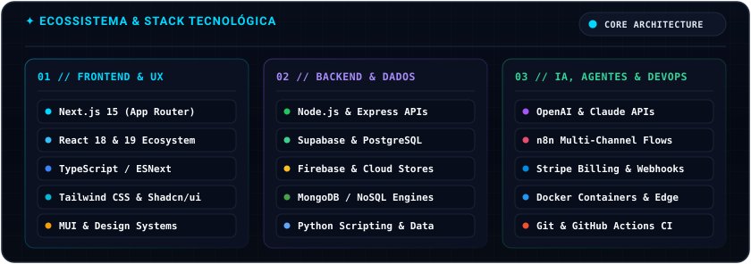

<!-- HERO BANNER ANIMADO -->

  

<!-- STATIC METRICS & ANALYTICS (100% UPTIME) -->

  

<!-- MATRIX DIGITAL RAIN CONTRIBUTION GRID -->

<!-- BENTO ROW 1: TERMINAL INTERATIVO & CORE IDENTITY -->
<table border="0" cellspacing="0" cellpadding="0" width="100%">
  <tr>
    <td width="58%" valign="top">
       
      
    </td>
    <td width="42%" valign="middle" style="padding-left: 24px;">
      <h3>⚡ Sobre Mim &amp; Arquitetura</h3>
      

        Desenvolvedor Fullstack com foco em <b>soluções escaláveis, SaaS de alta performance e automações inteligentes com IA</b>.
      

      

        Combino código limpo com arquiteturas modernas para transformar ideias complexas em produtos prontos para produção, com velocidade extrema e máxima confiabilidade.
      

    </td>
  </tr>
</table>

<!-- BENTO ROW 2: TECH STACK ECOSYSTEM -->

  

<!-- BENTO ROW 3: CALL TO ACTION & FOOTER -->

  

    

  

