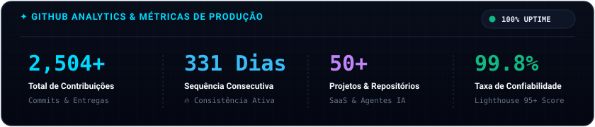

<!-- HERO BANNER ANIMADO -->

  

<!-- STATIC METRICS & ANALYTICS (100% UPTIME) -->

  

<!-- MATRIX DIGITAL RAIN CONTRIBUTION GRID -->

<!-- BENTO ROW 1: TERMINAL INTERATIVO & CORE IDENTITY -->
<table border="0" cellspacing="0" cellpadding="0" width="100%">
  <tr>
    <td width="58%" valign="top">
       
      
    </td>
    <td width="42%" valign="middle" style="padding-left: 24px;">
      <h3>⚡ Sobre Mim &amp; Arquitetura</h3>
      

        Desenvolvedor Fullstack com foco em <b>soluções escaláveis, SaaS de alta performance e automações inteligentes com IA</b>.
      

      

        Combino código limpo com arquiteturas modernas para transformar ideias complexas em produtos prontos para produção, com velocidade extrema e máxima confiabilidade.
      

    </td>
  </tr>
</table>

<!-- BENTO ROW 2: TECH STACK ECOSYSTEM -->

  <h2>🛠️ Ecossistema &amp; Stack Tecnológica</h2>
  
<i>As ferramentas e linguagens que utilizo diariamente para criar produtos excepcionais:</i>

   

  <!-- FRONTEND -->
  

    <b>Frontend &amp; Experiência do Usuário</b> 
    
  

  <!-- BACKEND & DATA -->
  

    <b>Backend, Bancos de Dados &amp; Cloud</b> 
    
  

  <!-- TOOLS, AI & DEVOPS -->
  

    <b>IA, Automações &amp; Infraestrutura</b> 
    
  

<!-- BENTO ROW 5: CALL TO ACTION & FOOTER -->

  <h2>🤝 Vamos Construir Algo Extraordinário?</h2>
  
Estou aberto para desenvolvimento de novos produtos SaaS, integrações de IA e consultoria técnica.

   

  

    
    &nbsp;&nbsp;
    
  

   

  

  
<i>"Construindo o futuro com arquiteturas escaláveis, código limpo e inteligência artificial."</i>

